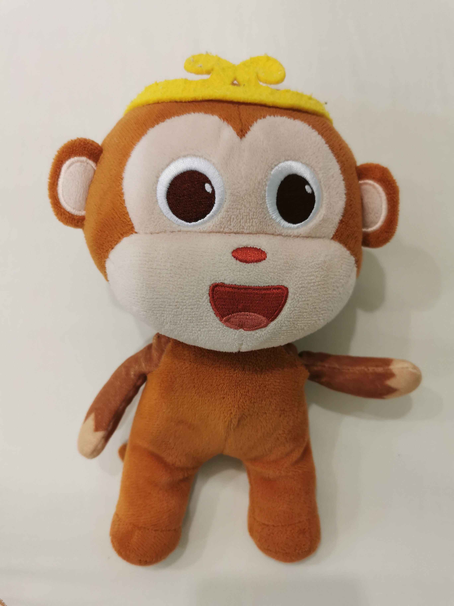
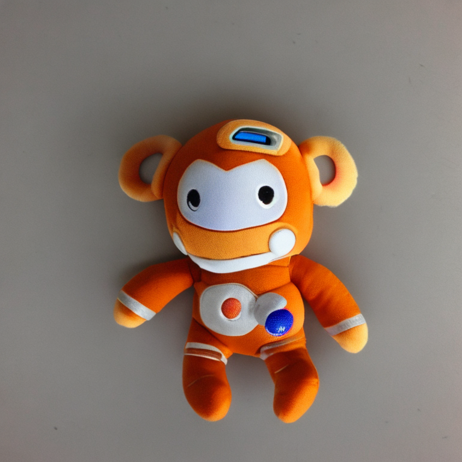

# Deep Learning Step By Step
================

## Overview

This is a summary of projects that I developed for study of Deep Learning.

There are many frameworks and libraries out there. Fastai is a good starting point. Huggingface has huge amount of models for use. From scratch projects are very good for learning the fundamentals. 

There are so many ML concepts, designs and models to learn and try. I hope to grasp this revolutionary technology and make use of AI to solve real world problems. 

## Projects that have been completed

1. <b>`Pet classifier`</b>

    This is a fine-tuned resnet that can do simple image classification (cat or dog) task.
    
    Try it at Huggingface Spaces: [A pet classifier](https://huggingface.co/spaces/wb-droid/pet_classifier)

    References:

    The original model definition and training can be found in fastai's ["Saving a Cats v Dogs Model"](https://github.com/fastai/course22/blob/master/02-saving-a-basic-fastai-model.ipynb). 
    The method to build a gradio web app on Huggingface Spaces is nicely described in Tanishq's ["Gradio + HuggingFace Spaces: A Tutorial"](https://www.tanishq.ai/blog/posts/2021-11-16-gradio-huggingface.html).

2. <b>`HDB price predictor`</b>

    There are some very good existing HDB price predictor projects using RandomForests. I tried something different -- training a neural network to predict HDB prices. I only traind with a small portion of old data from 1997-01 to 2020-01 for evaluation. The result is pretty good with <b>mean absolute error of S$14k</b>. For prediction after training period, the mean absolute error is S$20k. When using this model to predict current price at 2024-03, after adjust by Resale Price Index, the predicted price has a bit higher mean absolute error of S$37k.

    Try the model at Huggingface Spaces: [HDB price predictor](https://huggingface.co/spaces/wb-droid/HDB_price_predictor).

    Data analysis, model, training and evaulation details can be found in this [Jupyter notebook](HDB_price_predictor/PricePredictor.ipynb).

    References:

    This model uses [fastai's framework](https://docs.fast.ai/tutorial.tabular.html). 
    There is a very good [Exploratory Data Analysis on the HDB data by teyang-lau](https://github.com/teyang-lau/HDB_Resale_Prices). His model was built with Linear Regression and RandomForest. 
    Data is from [data.gov.sg](https://data.gov.sg).

3. <b>`Stable Diffusion Text Inversion`</b>

    Stable Diffusion can be fine-tuned to add new concept/style. This is an interesting scheme. 
    I trained Stable Diffusion to add a new token `<monkey-toy>` that represents my son's monkey toy: 
    
    
        
    After that, prompt of `"a <monkey-toy> in space suit"` can generate this: 
    
    

    Data, model, training and inference details can be found in this [Jupyter notebook](Text_inversion/sd_textual_inversion_training_mk.ipynb). 

    References:

    This model and training code is mainly from [Huggingface's notebook](https://colab.research.google.com/github/huggingface/notebooks/blob/main/diffusers/sd_textual_inversion_training.ipynb). 
    Additonal info can be found in [huggingface](https://huggingface.co/docs/diffusers/en/using-diffusers/loading_adapters#textual-inversion).

4. <b>`Image Captioning`</b>

    Image captioning is more flexible then categorization, and privides more infomation on the objects in the image such as positional data. COCA Model claimed to have have the capability "to directly applicable to image captioning tasks as an encoder-decoder model". I tested the "monkey toy" image  
     with OpenCLIP and COCA. The generated caption is `"a stuffed monkey with a crown on it 's head"`. Pretty good.

    Model and inference details can be found in this [Jupyter notebook](Image_caption/openCLIP_COCA_image_caption.ipynb). 

    References:

    The code is from this [OpenCLIP's notebook](https://colab.research.google.com/github/mlfoundations/open_clip/blob/master/docs/Interacting_with_open_coca.ipynb).  
    CoCa paper is [here](https://arxiv.org/abs/2205.01917). 
    OpenCLIP repo is [here](https://github.com/mlfoundations/open_clip).

5. <b>`Chinese poem generator`</b>

    NLP Transformer models are very popular. There are many existing implementations and pretrained models. Creating one from scratch is good learning and practise. To make is managable and useful, a Chinese poem generator is the target.

    Model and training details can be found in https://github.com/wb-droid/myGPT/.

    a. A basic MLP model from scratch.

    Data is from https://github.com/Werneror/Poetry.

    First created a Chinese character level tokenizer. Built a simple Model just with token embedding, position embedding and MLP. After training for a while, the follow can be generated.

    `generate('终南')` -- `'终南汞懒飞收。俗始闻夜门。谁常波漫春'`
    
    `generate('灵者')` -- `'灵者轩愁。月看曲，贱朱光受，书初去雨'` 

    b. A GPT2-like model from scratch.

    Follow the original GPT2 design and "Attention is all you need" paper. Add on top of the above MLP model to have all the additional critical components such as casual self attention, layer norm, dropout, skip connection, etc. After training for a while, the follow can be generated.

    `generate('终南')` -- `'终南岸，水碧绿槐无处色。云雨初寒落月，江风满天。秋景遥，夜深烟暮春。一望青山里，千嶂孤城下，何远近东流。古人不见长空愁，万般心生泪难尽。'`
    
    `generate('灵者')` -- `'灵者，寒暑气凝空濛长。风雨如霜月，万顷不闻钟客归。白纻初行尽柳枝，黄花满衣无愁懒。春色，残红芳兰深，一声兮，九陌上，相思君王。'` 