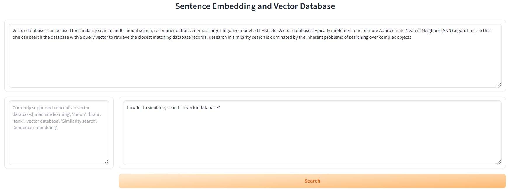

# Deep Learning Step By Step
================

## Overview

This is a summary of projects that I developed for study of Deep Learning.

There are many frameworks and libraries out there. Fastai is a good starting point. Huggingface has huge amount of models for use. From scratch projects are very good for learning the fundamentals. 

There are so many ML concepts, designs and models to learn and try. I hope to grasp this revolutionary technology and make use of AI to solve real world problems. 

## From Scratch Models/Applications

1. <b>`HDB price predictor`</b>

    There are some very good existing HDB price predictor projects using RandomForests. I tried something different -- training a neural network to predict HDB prices. I only traind with a small portion of old data from 1997-01 to 2020-01 for evaluation. The result is pretty good with <b>mean absolute error of S$14k</b>. For prediction after training period, the mean absolute error is S$20k. When using this model to predict current price at 2024-03, after adjust by Resale Price Index, the predicted price has a bit higher mean absolute error of S$37k.

    Try the model at Huggingface Spaces: [HDB price predictor](https://huggingface.co/spaces/wb-droid/HDB_price_predictor).
    <br>

    Data analysis, model, training and evaulation details can be found in this [Jupyter notebook](HDB_price_predictor/PricePredictor.ipynb).

    References:

    This model uses [fastai's framework](https://docs.fast.ai/tutorial.tabular.html).<br>
    There is a very good [Exploratory Data Analysis on the HDB data by teyang-lau](https://github.com/teyang-lau/HDB_Resale_Prices). His model was built with Linear Regression and RandomForest.<br>
    Data is from [data.gov.sg](https://data.gov.sg).

2. <b>`Chinese poem generator`</b>

    NLP Transformer models are very popular. There are many existing implementations and pretrained models. Creating one from scratch is good learning and practise. To make it managable and useful, a Chinese poem generator is the target.

    a. A basic MLP model from scratch.

    Data is from https://github.com/Werneror/Poetry.

    First created a Chinese character level tokenizer. Built a simple Model just with token embedding, position embedding and MLP. 
    
    Modle/training details can be found [here](https://github.com/wb-droid/myGPT/blob/main/MLP_model/GPTModel_MLP_.ipynb).

    After training for a while, the following can be generated.

    `generate('终南')` -- `'终南汞懒飞收。俗始闻夜门。谁常波漫春'`
    
    `generate('灵者')` -- `'灵者轩愁。月看曲，贱朱光受，书初去雨'` 


    b. A GPT2-like model from scratch.

    Follow the original GPT2 design and "Attention is all you need" paper. Add on top of the above MLP model to have all the additional critical components such as casual self attention, layer norm, dropout, skip connection, etc. After training for a while, the following nice poems can be generated.

    `generate('终南')` -- `'终南岸，水碧绿槐无处色。云雨初寒落月，江风满天。秋景遥，夜深烟暮春。一望青山里，千嶂孤城下，何远近东流。古人不见长空愁，万般心生泪难尽。'`
    
    `generate('灵者')` -- `'灵者，寒暑气凝空濛长。风雨如霜月，万顷不闻钟客归。白纻初行尽柳枝，黄花满衣无愁懒。春色，残红芳兰深，一声兮，九陌上，相思君王。'` 

    Model and training details can be found in https://github.com/wb-droid/myGPT/tree/main/GPT2_like.

    Try it at Huggingface Space: https://huggingface.co/spaces/wb-droid/myGPT.
    <br>
    <br>

3. <b>`Sentence Embedding, Vector Database and Semantic Search`</b>

    Besides used in semantic search applications, this project is also a good foundation for Retrival Augmented Generation I plan to build later.
    This is also very similar to CLIP model that performs contrastive training on image and text embedding. 

    a. Build a text embedding model with "BERT + mean pooling". 

    b. Build a contrastive training model following the paper [Sentence-BERT: Sentence Embeddings using Siamese BERT-Networks](https://arxiv.org/pdf/1908.10084). Train it to improve semantic search accuracy. 
    <br>

    c. Then use the trained model to implement a vector database (using data from a few wiki pages, chunk by sentence). Support cosine similarity for similarity search. 
    
    When testing with the model untrained, the search is not accurate. 
    
    `search_document("what is BERT?")` returns `Research in similarity search is dominated by the inherent problems of searching over complex objects.`, etc.

    When testing with the trained model, the search result is improved a lot.

    `search_document("what is BERT?")` returns `In practice however, BERT's sentence embedding with the [CLS] token achieves poor performance, often worse than simply averaging non-contextual word embeddings.`, etc.

    More details on the model, training and inference can be found [here](myTextEmbedding/).

    d. This model can be made faster and lighter. Embedding dimension reduction can help to reduce embedding storage but does not help model memory. Quantization is already used before on ChatGLM. So, this time I will try model Distillation, which uses the bigger model (teacher) to train a smaller model (student). Ilustrated below.  
    <br> [This diagram source](https://raw.githubusercontent.com/UKPLab/sentence-transformers/master/docs/img/monolingual-distillation.png) is from sentence-transformers.
    
    The student model is built by reducing BertEncoder from 12 BertLayers to 6 layers. And the model size is almost halved from 430MB to 260MB. Training model is implement as the diagram. After training, the student model performs similarly as the teacher, with matching top-2 similarity search result. More details on the models, training and inference can be found [here](./myTextEmbedding/model_distillation.ipynb).

    e. Build a huggingface space app to demo this model. An example vector database is pre-built with concepts searched from wiki, by [this script](./myTextEmbedding/create_vector_table.ipynb). User enters a question related to the concept. The app will use the question to do semantic search in the vector database and return the result.

    Try it at Huggingface Space [here](https://huggingface.co/spaces/wb-droid/SentenceEmbedding).
    <br>
    


## Pretrained Models Evaluation/Fine-tuning

1. <b>`Pet classifier`</b>

    This is a fine-tuned resnet that can do simple image classification (cat or dog) task.
    
    Try it at Huggingface Spaces: [A pet classifier](https://huggingface.co/spaces/wb-droid/pet_classifier)

    References:

    The original model definition and training can be found in fastai's ["Saving a Cats v Dogs Model"](https://github.com/fastai/course22/blob/master/02-saving-a-basic-fastai-model.ipynb).<br>
    The method to build a gradio web app on Huggingface Spaces is nicely described in Tanishq's ["Gradio + HuggingFace Spaces: A Tutorial"](https://www.tanishq.ai/blog/posts/2021-11-16-gradio-huggingface.html).

2. <b>`Stable Diffusion Text Inversion`</b>

    Stable Diffusion can be fine-tuned to add new concept/style. This is an interesting scheme. 
    I trained Stable Diffusion to add a new token `<monkey-toy>` that represents my son's monkey toy: 
    
    
        
    After that, prompt of `"a <monkey-toy> in space suit"` can generate this: 
    
    

    Data, model, training and inference details can be found in this [Jupyter notebook](Text_inversion/sd_textual_inversion_training_mk.ipynb). 

    References:

    This model and training code is mainly from [Huggingface's notebook](https://colab.research.google.com/github/huggingface/notebooks/blob/main/diffusers/sd_textual_inversion_training.ipynb).<br>
    Additonal info can be found in [huggingface](https://huggingface.co/docs/diffusers/en/using-diffusers/loading_adapters#textual-inversion).

3. <b>`Image Captioning`</b>

    Image captioning is more flexible than classification, and privides more infomation on the objects in the image such as positional data. COCA Model claimed to have have the capability "to directly applicable to image captioning tasks as an encoder-decoder model". I tested the "monkey toy" image  
     with OpenCLIP and COCA. The generated caption is `"a stuffed monkey with a crown on it 's head"`. Pretty good.

    Model and inference details can be found in this [Jupyter notebook](Image_caption/openCLIP_COCA_image_caption.ipynb). 

    References:

    The code is from this [OpenCLIP's notebook](https://colab.research.google.com/github/mlfoundations/open_clip/blob/master/docs/Interacting_with_open_coca.ipynb). <br>
    CoCa paper is [here](https://arxiv.org/abs/2205.01917).<br>
    OpenCLIP repo is [here](https://github.com/mlfoundations/open_clip).

4. <b>`Object Detection`</b>

    Object Detection is can be used to detect the objects and object locations in image from text query. I tested the OWL-ViT model with "monkey toy" image. The detected objects and locations are below.
    <br>

    Model and inference details can be found in this [Jupyter notebook](Object_detection/object_detection.ipynb). 

    References:

    The inference code is from this [notebook](https://github.com/huggingface/notebooks/blob/main/transformers_doc/en/pytorch/zero_shot_object_detection.ipynb). <br>
    OWL-ViT repo is [here](https://github.com/google-research/scenic/tree/main/scenic/projects/owl_vit).

5. <b>`Model Quantization and CPU deployment`</b>

    Language Models are growing bigger and more capable. My GPU with 6G VRAM cannot run any serious model. Quantization is a good way to reduce model inference cost. 
    The ChatGLM3 model is 12G. After quantization with [chatglm.cpp](https://github.com/li-plus/chatglm.cpp), its size is reduced to 3.4G. 

    a. The quantized model runs slower on CPU than GPU, but it's reasonably acceptable on my laptop, generating at 10 tokens/s. However, when running on the free huggingface space CPU, it's crawling like a snail. If you have patience, you can try it [here](https://huggingface.co/spaces/wb-droid/ChatGLM3_Quantized).

    b. To improve this further, GPU + CPU scheme can make use of both CPU and GPU to provide a good ballance between speed and memory. First, make [this change to enable GPU/CPU mix](https://github.com/li-plus/chatglm.cpp/issues/218). Then, make [this change if you encouter same issue](https://github.com/li-plus/chatglm.cpp/issues/140). Also need to install [Nvidia Container Toolkit](https://docs.nvidia.com/datacenter/cloud-native/container-toolkit/latest/install-guide.html). Then, build and run with below to enjoy much improved speed:
    
    ```
    docker build . --network=host -t chatglm.cpp-cuda \
    --build-arg BASE_IMAGE=nvidia/cuda:12.2.0-devel-ubuntu20.04 \
    --build-arg CMAKE_ARGS="-DGGML_CUBLAS=ON"
    
    docker run -it --rm --gpus all -v $PWD:/chatglm.cpp/models chatglm.cpp-cuda ./build/bin/main -m models/chatglm-ggml.bin -i
    ```

    To enable python binding, run the following before load and run the model as usual. Note Gradio in docker need to set server name to expose port -- `demo.queue().launch(share=False, server_name="0.0.0.0")`.

    ```
    docker run -it --rm --gpus all -v $PWD:/chatglm.cpp/models chatglm.cpp-cuda /bin/bash
    docker run -p 7860:7860 -it --rm --gpus all -v $PWD:/chatglm.cpp/models chatglm.cpp-cuda /bin/bash
    python3 -m pip install torch tabulate tqdm transformers accelerate sentencepiece gradio
    
    python3.8 cli_demo.py
    python3.8 web_demo.py    
    ```